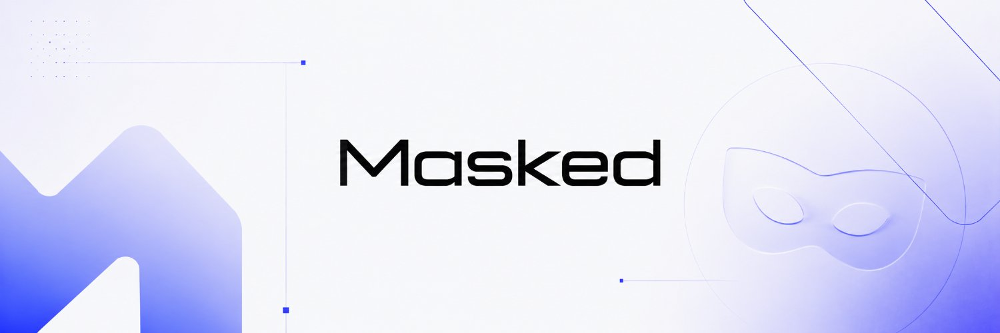

<div align="center">



<br />

### The dollar that can be private.

A privacy stablecoin on Base — $USDM, a dollar backed 1:1 by native USDC, with an opt-in zero-knowledge shielded layer where balances and transfers are proven correct in your browser instead of broadcast to everyone.

<br />

[](./LICENSE)
[](https://www.maskedusd.com)
[](https://basescan.org)
[](#trust--governance)
[](#trust--governance)
[](https://nextjs.org)
[](https://www.typescriptlang.org)
[](https://noir-lang.org)

<br />

[**Website**](https://www.maskedusd.com) · [**App**](https://www.maskedusd.com/app) · [**Whitepaper**](https://www.maskedusd.com/whitepaper) · [**X**](https://x.com/MaskedUSD) · [**Telegram**](https://t.me/maskedusd)

</div>

---

## Contents

- [What is MaskedUSD](#what-is-maskedusd)
- [How it works](#how-it-works)
- [Architecture](#architecture)
- [Deployed contracts](#deployed-contracts)
- [Trust &amp; governance](#trust--governance)
- [Compliance posture](#compliance-posture)
- [The two tokens](#the-two-tokens)
- [Tech stack](#tech-stack)
- [Local development](#local-development)
- [Security](#security)
- [Risks](#risks)
- [Links](#links)
- [License](#license)

---

## What is MaskedUSD

On a public blockchain, every balance and every payment is visible to anyone, forever. That is a strange default for money.

MaskedUSD keeps the part of a stablecoin that *should* be public — that it is fully backed and that every transfer is valid — public, and makes the part that *should* be personal — who holds what and who pays whom — private, at the holder's option.

- **$USDM** is a public ERC-20 dollar. It mints 1:1 against native USDC and is redeemable 1:1 at any time. The USDC backing sits in an immutable on-chain vault.
- **Shielding is opt-in.** $USDM can be moved into a zero-knowledge **shielded pool**, where balances and transfers become private notes. Proofs are generated **client-side, in your browser** — note secrets never leave your device.
- **The system is live** on Base mainnet (chain `8453`). All core contracts are **immutable** (non-upgradeable) and source-verified on Basescan.
- **It is not a mixer.** Privacy is designed for everyday financial confidentiality and to *complement* compliance, not to obscure the origin of funds — see [Compliance posture](#compliance-posture).

> $USDM is *the dollar that can be private* — privacy is a property of the pool you move it through, not a claim that every balance is hidden. Amounts entering and leaving the pool are public, like any on-chain transaction; what stays private is the transaction graph and balances *inside* the pool.

---

## How it works

A dollar's round trip through MaskedUSD:

| Step | Action | What happens |
| --- | --- | --- |
| **01 · Mint** | Deposit USDC at the ramp | Receive public $USDM 1:1. Screening runs here. |
| **02 · Shield** | Prove a note commitment in-browser | $USDM moves into the shielded pool as a private note. |
| **03 · Send** | JoinSplit transfer | Pay any `musd1…` address privately — amounts and recipients stay off the ledger. |
| **04 · Withdraw** | Prove ownership + association-set membership | The note returns to public $USDM. |
| **05 · Redeem** | Burn $USDM at the ramp | Native USDC returns to your wallet. Screening runs again. |

Inside the pool, dollars are **notes** (UTXOs) whose contents only their owner knows:

```
commitment = Poseidon(value, owner_pubkey, blinding, asset_id)
owner_pub  = Poseidon(owner_privkey)
nullifier  = Poseidon(owner_privkey, leaf_index)
```

Commitments are appended to a **depth-32 incremental Merkle tree** (Poseidon nodes), the same tree the contracts, the circuits, and the client compute identically. Spending a note reveals only its **nullifier**, which marks it spent without disclosing which commitment it was — so double-spends are impossible while on-chain unlinkability is preserved.

Private transfers are **JoinSplit** (2-in / 2-out): spend two input notes, create two output notes (payment + change), and prove in zero knowledge that `Σ inputs = Σ outputs + fee`. Value is conserved without revealing any amount.

---

## Architecture

Five conceptual layers, from the public surface down to private payment discovery:

1. **Public $USDM ERC-20** — a standard 6-decimal dollar, LP-able and transferable like any token; mint/burn callable only by the ramps.
2. **Mint / redeem ramps** — `USDCVault`, `MintRamp`, `RedeemRamp`. The legible fiat boundary, with a sanctions-screening hook enforced on-chain at both entry and exit.
3. **Shielded pool** — a Poseidon commitment tree + nullifier set holding UTXO / JoinSplit notes (depth-32 Merkle). The privacy core.
4. **Proving layer** — circuits written in **Noir**, proven with **UltraHonk** (Barretenberg, BN254 curve), entirely **client-side in WASM**. Immutable on-chain verifier contracts check every `shield` / `transfer` / `unshield` proof. There is no trusted proving service.
5. **Encrypted note channel** — `NoteMemo`, a permissionless, fund-less contract where senders post note secrets encrypted to the recipient's viewing key. Recipients scan and trial-decrypt to discover incoming payments. Decoupled from the pool's value transfer.

A **Privacy-Pools-style association set** gates unshield: withdrawals prove membership in an accepted association root, so honest funds can prove clean provenance and privacy complements compliance.

**The solvency invariant** holds at all times:

> `USDC in the vault ≥ public USDM supply + shielded value`

Minting increases both sides; redeeming decreases both. No path creates $USDM without locking USDC, and none releases USDC without burning $USDM. Pausing halts entries during an incident, but **exits keep working by design** — a pause can never trap user funds.

---

## Deployed contracts

Live on **Base mainnet** (chain `8453`). All contracts are immutable and source-verified on Basescan.

> **Verify by address**, not by name or ticker. Anything else claiming to be MaskedUSD is not us.

| Contract | Role | Address |
| --- | --- | --- |
| **USDM** (ERC-20) | The public dollar surface | [`0x09a4184daEdaCdcCcded6087f576E57a05950fef`](https://basescan.org/address/0x09a4184daEdaCdcCcded6087f576E57a05950fef) |
| **USDCVault** | Custodies the 1:1 native-USDC backing | [`0x7dD602d140C7f12591a9CcBF0d5300F566e36464`](https://basescan.org/address/0x7dD602d140C7f12591a9CcBF0d5300F566e36464) |
| **MintRamp** | USDC in → USDM out (screening hook) | [`0x16154843AB66ca01CD14d6f36566479FAA2A3Df3`](https://basescan.org/address/0x16154843AB66ca01CD14d6f36566479FAA2A3Df3) |
| **RedeemRamp** | USDM in → USDC out (screening hook) | [`0x6D6E4c124bCb94EA8364FAC4691A779e68d23CDb`](https://basescan.org/address/0x6D6E4c124bCb94EA8364FAC4691A779e68d23CDb) |
| **ShieldedPool** | Commitment tree + nullifier set — the privacy core | [`0x0e694f3243a89a91597A35B188F91750b1F1CDe6`](https://basescan.org/address/0x0e694f3243a89a91597A35B188F91750b1F1CDe6) |
| **NoteMemo** | Encrypted payment-notice channel for private sends | [`0xF276B64C7e4456fF072D787694c7615A0F62C941`](https://basescan.org/address/0xF276B64C7e4456fF072D787694c7615A0F62C941) |

Backing asset: native **USDC** on Base — [`0x833589fCD6eDb6E08f4c7C32D4f71b54bdA02913`](https://basescan.org/address/0x833589fCD6eDb6E08f4c7C32D4f71b54bdA02913).

---

## Trust &amp; governance

MaskedUSD is **non-custodial**: operators never hold user funds or keys, and users self-custody at every step. The core contracts are **immutable** — no proxies, no upgrade path, no admin withdrawal path.

A single limited on-chain **guardian** role exists. Its authority is deliberately narrow:

- It **can** pause contract entry points (a circuit-breaker — exits are never pausable, so a pause cannot trap funds).
- It **can** accept association-set roots that gate unshield.
- It **cannot** move, mint, freeze, or access user funds or keys, and it cannot upgrade any contract.

Root acceptance is the one exit-side power the guardian holds: which association roots are accepted determines which notes can withdraw. That is the compliance lever, named plainly — not a fund-control or freeze power.

---

## Compliance posture

**MaskedUSD is explicitly not a mixer or tumbler.** The goal is not to hide where money came from — it is that your finances should not be a public feed. The design follows the [Privacy Pools](https://arxiv.org/abs/2405.17435) approach:

- **Screen where money is legible.** Every mint and every redemption passes an on-chain screening check at the ramp — the point where dollars touch the regulated world. The shielded pool itself never needs to see identities.
- **Association-set exits.** Every withdrawal proves membership in an association root accepted on-chain, so flagged funds can be excluded from exits without deanonymizing anyone else.
- **Validity is always public.** Backing, supply, and every state transition are publicly verifiable at all times. Privacy applies to *who* and *how much* — never to whether the system is solvent and correct.
- **Selective disclosure.** Each account derives a read-only viewing key, so honest users can voluntarily prove their own note history to an auditor or counterparty without weakening privacy against everyone else.

> Privacy for normal people — not a tool for evading the law. Lawful use only.

---

## The two tokens

Two tokens, two jobs, kept deliberately distinct.

| | **$USDM** | **$MUSD** |
| --- | --- | --- |
| **What it is** | The private dollar — the product | A separate ecosystem / utility token |
| **Backing** | 1:1 native USDC in the immutable vault | **Unbacked** |
| **Stability** | Redeemable 1:1 at any time | **Volatile — can go to zero** |
| **Yield** | None — it is a dollar, not an investment | **None — no APY, no staking returns** |
| **Where** | Live on Base | Launches on Clanker |

> **$MUSD is not a stablecoin, not backed by anything, pays no yield, and is not an investment or security.** Its role is utility, access, and community around the protocol. No $MUSD mechanism can ever touch $USDM's backing — the dollar stands on USDC alone. This repository is about the protocol and site, not $MUSD.

---

## Tech stack

| Layer | Technology |
| --- | --- |
| Framework | Next.js 16 (App Router), React 19, TypeScript 5 |
| Styling | Tailwind CSS v4 |
| Motion / 3D | framer-motion, three.js |
| On-chain | wagmi, viem |
| Zero-knowledge | Noir (`@noir-lang/noir_js`), Barretenberg (`@aztec/bb.js`), Poseidon (`poseidon-lite`) |
| Cryptography | `@noble/curves`, `@noble/hashes`, `@noble/ciphers` |
| Hosting | Vercel |

---

## Local development

```bash
# install dependencies
npm install

# run the dev server
npm run dev        # http://localhost:3000

# production build
npm run build
npm run start

# lint
npm run lint
```

The dApp consumes the live Base mainnet contracts by default. Authoritative addresses live in [`src/lib/contracts.ts`](./src/lib/contracts.ts); the long-form protocol description renders at [`/whitepaper`](https://www.maskedusd.com/whitepaper).

---

## Security

- All contracts are **immutable** and **source-verified on Basescan** — anyone can review exactly what runs.
- Circuit and client note primitives are asserted **bit-exact** against shared test vectors, so a proof built in the browser verifies against the same tree the contracts maintain.
- Independent **security review and audits are in progress**; results will be published when complete. We do not claim an audit we do not have.
- A public **bug bounty is planned**.

Found something? Please email **security@maskedusd.com** or reach us via [Telegram](https://t.me/maskedusd) before public disclosure.

---

## Risks

A privacy protocol earns trust by being explicit about what can go wrong.

- **Smart-contract &amp; circuit risk.** A flaw in the contracts or the zero-knowledge circuits could put funds at risk. Immutability means bugs cannot be patched in place.
- **Issuer risk.** The backing is native USDC; its issuer can freeze the vault's balance, which would halt redemptions while it lasted.
- **Exit liveness.** Withdrawals require an association root accepted by the guardian. After new deposits, exits depend on the guardian accepting an updated root; if it stops, withdrawals stall until it resumes.
- **Privacy limits.** Privacy strengthens with pool usage. Early on the anonymity set is small, and matching public shield/withdraw amounts or timing can narrow who paid whom. Network-level metadata (IP, RPC provider) is outside the protocol's protection.
- **Key loss.** Shielded note secrets exist only client-side. If you lose them and any backup, the notes are unrecoverable by anyone — including us.

---

## Links

| | |
| --- | --- |
| Website | https://www.maskedusd.com |
| App | https://www.maskedusd.com/app |
| Whitepaper | https://www.maskedusd.com/whitepaper |
| X / Twitter | https://x.com/MaskedUSD |
| Telegram | https://t.me/maskedusd |
| GitHub | https://github.com/maskedusd |
| Support | support@maskedusd.com |

---

## License

Licensed under the [Apache License 2.0](./LICENSE).

<div align="center">
<sub>This repository describes software — not an offer, solicitation, or financial advice. Privacy is opt-in and for lawful use only.</sub>
</div>
